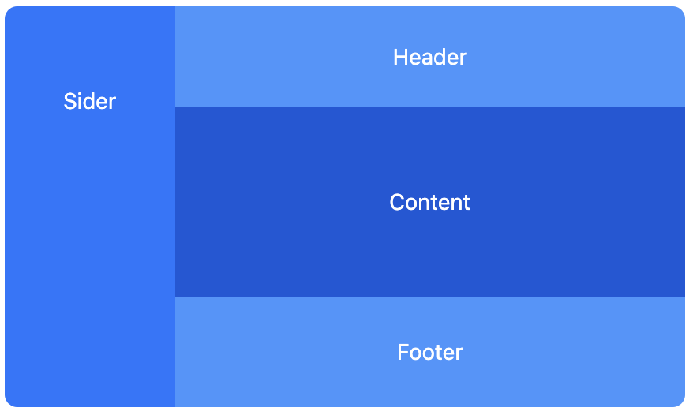

# Layout 组件实现

## 💡 题目描述

实现一个基本的 Layout 组件

## 📋 基本要求

### 布局区域

包含四个主要区域：

* Sider（侧边栏）
* Header（页眉）
* Content（主内容）
* Footer（页脚）

### 布局特性

* Sider 固定在左侧，占据页面左侧全部高度
* Header、Footer 固定在上/下位置，不随滚动条滚动
* Content 占据剩余空间，具有自动拉伸能力

### Sider 展开/收起

* 添加收起按钮，折叠时宽度变为 60px，仅显示图标
* 实现状态管理（useState/computed）

### 响应式断点折叠

* 当窗口宽度小于一定值（如 768px）时自动收起
