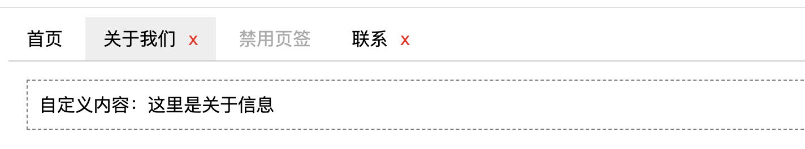

# 🎯 Tab 标签页组件设计与实现

## 📝 题目描述
请使用 React 或 Vue 实现一个通用的 Tab 标签页组件，支持以下功能：


## ✅ 基础要求
- 支持多个标签页切换显示内容
- 默认激活第一个标签页
- 支持通过 props 传入标签页标题和内容
- 支持点击标签页切换内容

## 💡 加分项
- 支持通过 slot 或 render 函数自定义内容区域
- 支持受控模式（通过外部控制激活标签页）
- 支持禁用某个标签页
- 支持标签关闭功能（点击关闭按钮移除该页签）

## 📦 示例数据
```javascript
[
  { title: '首页', content: '这是首页内容' },
  { title: '关于', content: '这是关于页面内容' },
  { title: '联系', content: '这是联系页面内容' }
]
```

## 🧪 要求
- 请确保组件具有良好的可读性和可维护性
- 代码结构清晰，必要时进行模块拆分
- 适当添加注释说明你的设计思路